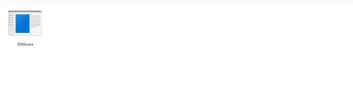

# Text Quest Interpreter Documentation

```version: 0.0.1```

This is the documentation for the Text Quest Interpreter
made for ["The Tool Jam 2"](https://itch.io/jam/the-tool-jam-2).

***WARNING: ONLY ASCII CHARACTERS ARE SUPPORTED AT THE MOMENT***

### Table of contents
- [Text Quest Interpreter Documentation](#text-quest-interpreter-documentation)
    - [Table of contents](#table-of-contents)
- [Quick Start](#quick-start)
- [Interactivity](#interactivity)
- [Text Formatting (And other Line effects)](#text-formatting-and-other-line-effects)
- [Block Parameters](#block-parameters)
- [Shaders](#shaders)
- [Saves, usage and misc](#saves-usage-and-misc)

# Quick Start
To create your very own text quest first thing you need to do is to use ***Text Quest Interpreter Project Wizard TM***. Usage is simple:
just toss any empty folder in it and it will create TQI project automatically!



In this project you will find the main script file: *YourProjectName*.tqi. This file contains json formatted script for your quest and by default looks like this:

```json
{
  "start": {
    "lines": [
      {
        "string": "Yoooo! This is an empty project!"
      }
    ]
  }
}
```
Here you can already see some hierarchy.
To put it simple every TQI project consists of a collection of named **blocks**. For example in this case there is only one block named `start`. Every project must have a `start` block because Interpreter seeks `start` block to... well... start the quest. Think of it as `main` function in your programming languages.

Block may have a `links` **array** that contains all the formatted text line that are showed in this block. Each line element **must** have a `string` element to show this string to the screen. Otherwise ***at this moment*** the program will crash.

# Interactivity
What's the main difference of text quests from your average books? One could say that it's special video effects, and they will be right, but as for me th main difference is **interactivity**.

TQI interactivity is based on **blocks** and **links**.
`links` is a special element of `block` that looks like this:

```json
{
    "start": {
        "lines": [
            {
                "string": "Yoooo! This is an empty project!"
            }
        ],
        "links": [
            {
                "keys": [
                    "next",
                    "further",
                    "advance"
                ],
                "id": "end"
            }
        ]
    },
    "end": {
        "lines": [
            {
                "string": "and this is second line!"
            }
        ]
    }
}
```
`links` defines an array of links (sorry for tautology) to other blocks of the game. Each link must contain `keys` element, that is also an array, that defines key-words (case insensitive) for the input command. For example if we have the keys like one above these inputs will trigger the link:
```
Next
FuRtHeR
Go to the next chapter
advance the story
``` 
and so on, the potential is endless.
The second parameter of `links` element is `id` OR `message`. `id` will create a link to other block, and `message` will display the string to the screen.

# Text Formatting (And other Line effects)
Each line of you super-duper game could be taken to a new level with ***text formatting***.
To each end every of your `block`'s `lines` you can assign these types of effects:

- **font**: it can be `"regular"`, `"bold"`, `"italic"` or `"boldItalic"`:
```json
{
    "string": "Yoooo! This is an empty project!",
    "font": "boldItalic"
}
```
default font is `regular`
- **textColor**: defines color of text as 3-nums RGB array:

```json
{
    "string": "Yoooo! This is an empty project!",
    "textColor": [ 235, 83, 70 ]
}
```
default color is `White`

- **textSize**: defines absolute text size in pixels as number:
```json
{
    "string": "Yoooo! This is an empty project!",
    "textSize": 64.0
}
```
default size is `32` pixels

- **del**: defines a delimeter of appearence of each letter in ms:
```json
{
    "string": "Yoooo! This is an empty project!",
    "del": 50
}
```
default delimeter is `30`ms

Also you can specify **sound** effects for your line:

- **sound**: defines the sound file that will play, when this line appears by `file` and `volume`:
```json
{
    "string": "Yoooo! This is an empty project!",
    "sound": {
        "file": "scarySound.ogg", // Not optional
        "volume": 20 // Optional (default is 100)
    }
}
```
Sound file is being taken from `sounds` folder of your project. Volume is in range of `[0, 100]`

- **typeSound**: defines the sound that each letter will emit when drawn:
```json
{
    "string": "Yoooo! This is an empty project!",
    "typeSound": {
        "file": "boop.ogg", // Not optional
        "volume": 50 // Optional (default is 100)
    }
}
```
This sound has a default value, that is specified in TQI exec folder in `sounds` subfolder by the name `typeSound.ogg`.

when all effects are put together it will look something like this:
```json
{
    "string": "Yoooo! This is an empty project!",
    "font": "boldItalic",
    "textColor": [ 235, 83, 70 ],
    "textSize": 64.0,
    "del": 50,
    "sound": {
        "file": "scarySound.ogg", // Not optional
        "volume": 20 // Optional (default is 100)
    },
    "typeSound": {
        "file": "boop.ogg", // Not optional
        "volume": 50 // Optional (default is 100)
    }
}
```
end will emit this text line:
<p style = "color:rgb(235, 83, 70); font-size:64px;font-weight: bold; font-style: italic;">Yoooo! This is an empty project!</p>
(markdown cannot provide delimeter and sound support for obvious reasons, but I hope you get the idea)

# Block Parameters
You can add even more customization by adding global block settings:

- **font**: here you can specify ***font file*** for each of font styles:
```json
"start": {
    "lines": [
        {
            "string": "Yoooo! This is an empty project!"
        }
    ],
    "font": {
        "regular": "regular.ttf", // You can only specify one of them, or all
        "ialic": "ialic.ttf",     // or any combination.
        "bold": "bold.ttf",
        "boldItalic": "boldItalic.ttf"
    }
}
```
font files are being taken from `fonts` subfolder of your game folder.

- **backgoundColor**: color of the block background:
```json
"start": {
    "lines": [
        {
            "string": "Yoooo! This is an empty project!"
        }
    ],
    "backgroundColor": [ 162, 41, 32 ] // Again: 3 rgb values (default is Black)
}
```

- **textColor**: this *global* textColor specifies color of input field and message string:
```json
"start": {
    "lines": [
        {
            "string": "Yoooo! This is an empty project!"
        }
    ],
    "textColor": [ 255, 176, 150 ] // Again: 3 rgb values (default is White)
}
```

- **defaultMessage**: this field scpecifies the message that is being displayed if the input did not match any key. Something like `I don't know what you want from me, master` or something like that.
```json
"start": {
    "lines": [
        {
            "string": "Yoooo! This is an empty project!"
        }
    ],
    "defaultMessage": "I don't know what you want from me, master"
}
```

default value is: `Unknown command`

- **music** this field represents the music that is being played when the block is shown. Works pretty much like `sound`: with `file` and `volume`:
```json
"start": {
    "lines": [
        {
            "string": "Yoooo! This is an empty project!"
        }
    ],
    "music": {
      "file": "music.ogg",
      "volume": 50 // Optional
    }
}
```
Music file is being taken from `music` subfolder.

And the sweetest part:
- **shader**: specifies custom `.glsl` shader for the block:
```json
"start": {
    "lines": [
        {
            "string": "Yoooo! This is an empty project!"
        }
    ],
    "shader": "shader.glsl"
}
```
Shaders are being taken from `shaders` subfolder. Default shader is located in the engine folder in `shader` subfolder. [More on shaders later.](#shaders)

# Shaders
This section is a bit tricky, and if you are not familiar with glsl shaders, you should either trust the default shader, or learn how to use them.

For those who know a bit of gpu computing this is what default shader looks like:

```glsl
#define PI 3.1415

uniform vec2 scale; // Width and height of window
uniform sampler2D text; // render Texture
uniform float time; // time value

float rand(vec2 co){
    return fract(sin(dot(co, vec2(12.9898, 78.233))) * 43758.5453);
}

void main() {
    vec2 uv = gl_FragCoord.xy / scale;
    float koef = 0.3;
    float mult = koef * sin(uv.x * PI) * sin(uv.y * PI) + (1.0 - koef);

    gl_FragColor = vec4(texture(text, uv).xyz * mult + (rand(uv * time) * 0.06), 1.0);
}
```
This shader applies light vignette on the edges of the screen, and adds a bit of noise for dithering.

Each TQI shader **must** have three uniforms: `vec2 scale`, `sampler2D text` and `float time`.
`scale` uniform is needed to normalize `gl_FragCoord` vector to (0, 1) value.
`text` uniform holds the texture, that all graphics elements were rendered to.
`time` uniform is needed to manipulate shader through time, in that particular case it's needed to create dynamic noise.

So by manipulating these uniforms you can create cool effects for your game.

# Saves, usage and misc
This engine has autosave feature. Eeach project has folder `save` that `saveFile` is written to. SaveFile just memorizes the current block that you are in, no more, no less.

In the game pressing `F4` will toggle fullscreen mode.
`Enter` will advance the story, or evaluate input.
`Escape` exits the game.

Thats all you need to know about TQI folks!